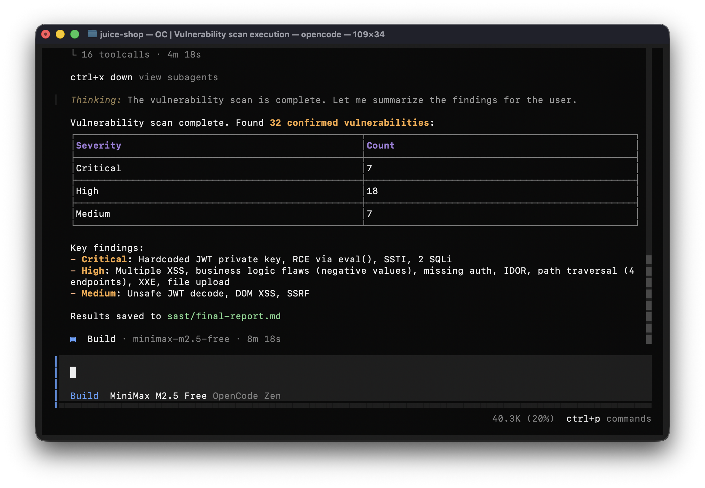

# LLM SAST Skills

A collection of agent skills that turn your LLM coding assistant into a fully functional SAST scanner to find vulnerabilities in your codebase. Works natively with Claude Code, Codex, Opencode, Cursor and any other assistant that supports agent skills. No third-party tools required.

Claude Code with Opus model is recommended. But if the cost is a concern, use any IDE and model you trust.



## How It Works

`CLAUDE.md` (for Claude Code) or `AGENTS.md` (for Opencode and other IDEs) orchestrates the entire assessment workflow automatically. The assessment runs in three steps:

1. **Codebase Analysis** -- The `sast-analysis` skill maps the technology stack, architecture, entry points, data flows, and trust boundaries. It writes its findings to `sast/architecture.md`.

2. **Vulnerability Detection (parallel)** -- All 13 vulnerability detection skills run in parallel as subagents. Each skill follows a two-phase approach: first a recon/discovery phase to find candidate sections, then a verification phase to confirm exploitability. Results are written to `sast/*-results.md`.

3. **Report Generation** -- The `sast-report` skill consolidates all findings into a single `sast/final-report.md`, ranked by severity with full remediation guidance and dynamic test instructions.

## What It Detects

| Skill | Vulnerability Class |
|---|---|
| sast-analysis | Codebase reconnaissance, architecture mapping, threat modeling |
| sast-sqli | SQL Injection |
| sast-graphql | GraphQL injection |
| sast-xss | Cross-Site Scripting (XSS) |
| sast-rce | Remote Code Execution (command injection, eval, unsafe deserialization) |
| sast-ssrf | Server-Side Request Forgery |
| sast-idor | Insecure Direct Object Reference |
| sast-xxe | XML External Entity |
| sast-ssti | Server-Side Template Injection |
| sast-jwt | Insecure JWT implementations |
| sast-missingauth | Missing authentication and broken function-level authorization |
| sast-pathtraversal | Path / directory traversal |
| sast-fileupload | Insecure file upload |
| sast-businesslogic | Business logic flaws (price manipulation, workflow bypass, race conditions, etc.) |
| sast-report | Consolidated final report ranked by severity |


## Installation

Copy your project into the `sast-files` folder, then open `sast-files` as your workspace in your AI coding assistant.

```bash
cp -r /path/to/your/project sast-files/
```

> **Note:** If your project already contains a `CLAUDE.md` or `AGENTS.md` file, remove it before running the assessment — otherwise it will conflict with the orchestration file provided by this toolkit.


## Usage

After copying the files, open your project in your AI coding assistant and ask:

> Run vulnerability scan

or

> Find vulnerabilities in this codebase

The entry point file (`CLAUDE.md` or `AGENTS.md`) orchestrates the full workflow automatically. It will skip any steps whose output files already exist, so you can safely re-run it after fixing issues.

## Output

All output is written to a `sast/` folder in your project root:

| File | Description |
|---|---|
| `sast/architecture.md` | Technology stack, architecture, entry points, data flows |
| `sast/*-results.md` | Per-vulnerability-class findings with proof and remediation |
| `sast/final-report.md` | Consolidated report ranked by severity |
